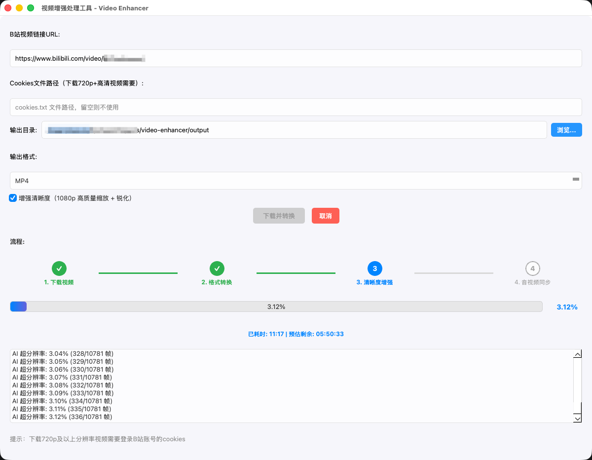

# B站视频增强下载器

一款基于 PyQt5 的 B站视频下载与增强工具，支持 AI 超分辨率、FFmpeg 高清处理、音视频同步等功能。

## ✨ 功能特点

- **B站视频下载**：支持输入 B站视频地址或 B站短链下载视频
- **批量任务队列**：支持动态添加多个 B站 URL，并按任务列表逐个下载和转换
- **地址校验**：下载前校验 URL 格式、地址可访问性，并拦截非 B站视频网页
- **AI 超分辨率**：集成 Real-ESRGAN 进行 4 倍放大，提升视频清晰度
- **FFmpeg 增强**：高质量缩放、锐化、降噪、对比度调整等多种滤镜
- **音视频同步**：自动修复音视频不同步问题
- **帧缓存机制**：跳过已处理帧，支持断点续处理
- **多步骤进度显示**：可视化展示下载、转换、增强、同步各步骤进度
- **实时耗时预估**：显示已耗时和预估剩余时间

## 📸 界面截图



## 📁 项目结构

```
video_enhancer/
├── src/                    # 源代码目录
│   └── video_enhancer.py   # 主程序文件
├── tools/                  # 工具脚本目录
│   ├── download_realesrgan.py   # Real-ESRGAN 工具下载脚本
│   └── download_models.py       # 模型文件下载脚本
├── resources/              # 资源目录
│   ├── icons/              # 图标文件
│   │   ├── logo.png
│   │   └── logo_*.png
│   └── models/             # Real-ESRGAN 模型文件
│       ├── realesrgan-x4plus.bin
│       ├── realesrgan-x4plus.param
│       └── ...
├── output/                 # 输出目录（存放处理后的视频）
├── temp/                   # 临时目录（存放视频帧等临时文件）
├── README.md               # 项目说明
└── README_macos.md         # macOS 特定说明
```

## 🛠️ 环境要求

- Python 3.9+
- macOS (推荐) / Windows / Linux
- 依赖库：
  - PyQt5
  - OpenCV (`opencv-python`)
  - you-get (视频下载)
  - FFmpeg (视频处理)
  - Real-ESRGAN (可选，AI 超分辨率)

## 🚀 快速开始

### 安装依赖

```bash
# 安装 Python 依赖
pip install PyQt5 opencv-python you-get

# 安装 FFmpeg
# macOS
brew install ffmpeg

# Ubuntu/Debian
sudo apt-get install ffmpeg

# Windows
# 下载并安装：https://ffmpeg.org/download.html
```

### 下载 Real-ESRGAN 工具（可选）

```bash
python tools/download_realesrgan.py
```

### 运行程序

```bash
python src/video_enhancer.py
```

## 📖 使用说明

1. **添加 B站视频任务**：输入 B站视频地址或 B站短链，点击"添加任务"加入列表
2. **动态管理任务**：可继续添加 URL，也可删除选中任务或清空列表
3. **选择输出目录**：默认输出到项目的 `output/` 目录
4. **设置输出格式**：支持 MP4、FLV、MKV 等格式
5. **选择增强选项**：勾选"增强清晰度"启用 AI/FFmpeg 增强
6. **配置 Cookies**（可选）：下载高清视频可能需要登录 cookies
7. **点击开始下载**：程序会按任务列表顺序逐个执行下载、转换、增强、同步等步骤
8. **查看任务状态**：流程区域会显示任务总数、当前第几个任务进行中，以及当前任务执行到哪一步
9. **取消任务**：批量处理时可选择"取消当前"跳过当前任务，或选择"取消全部"停止整个队列

## 🎯 处理流程

```
步骤1: 下载视频
    ↓
步骤2: 格式转换
    ↓
步骤3: 清晰度增强
    ├── Real-ESRGAN AI 超分辨率（优先）
    └── FFmpeg 高级增强（降级方案）
    ↓
步骤4: 音视频同步
    ↓
完成: 输出增强后的视频
```

## 🔁 断点续处理说明

- 已下载的视频会记录在 `temp/task_state.json`，再次处理同一视频时会跳过下载。
- 已转换的视频如果仍存在，会跳过格式转换步骤。
- 已提取的视频帧会保存在 `temp/temp_frames/`，帧数匹配且属于同一视频时会跳过提取。
- 已完成 AI 超分辨率的帧会保存在 `temp/enhanced_frames/`，重新运行时只处理缺失帧，不会重复处理已增强帧。
- B站链接参数可能变化，程序会同时根据 URL、转换后文件路径判断是否属于同一视频，降低误判导致重新处理的概率。
- 不要手动删除 `temp/temp_frames/`、`temp/enhanced_frames/` 或 `temp/task_state.json`，否则断点续处理会失效。

## ⚠️ 注意事项

- AI 超分辨率处理速度较慢，建议在处理前评估视频时长
- 大尺寸视频可能需要较多磁盘空间（临时帧文件）
- 下载某些网站的高清视频可能需要登录 cookies
- Real-ESRGAN 需要 GPU 加速才能获得较好的处理速度
- 如果 AI 超分辨率中断，重新运行后会显示已增强帧数和剩余待处理帧数，并从缺失帧继续处理

## 📝 更新日志

### v1.1
- 优化 Real-ESRGAN 断点续处理逻辑，避免未完成的增强帧目录被清空
- 增加同一视频缓存识别，支持 URL 参数变化时复用已提取帧和已增强帧
- 优化高帧数视频的帧目录扫描，减少跳过阶段卡顿
- 调整 AI 超分辨率进度提示，明确显示已增强帧数和剩余待处理帧数

### v1.0
- 初始版本发布
- 支持视频下载和格式转换
- 集成 Real-ESRGAN AI 超分辨率
- 实现 FFmpeg 降级增强方案
- 添加进度条和步骤显示
- 实现音视频同步功能

## 📄 许可证

MIT License
